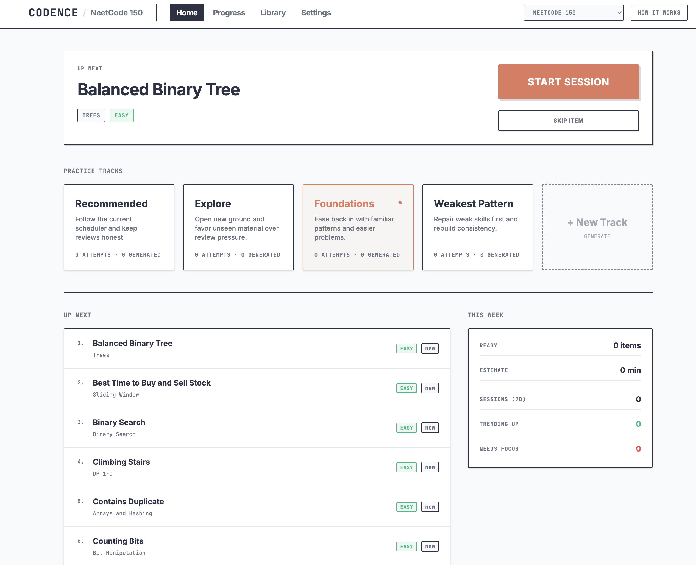
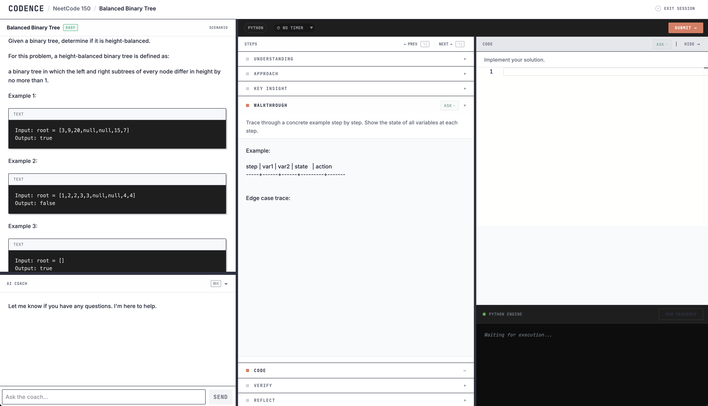

<div align="center">

# Codence

**A Socratic DSA coach with policy-driven tracks and spaced repetition.**

Plain-English study goals compile into a typed selection policy · step-aware AI coaching · sandboxed code execution · pluggable spaced-repetition scheduler.

Local-first. Your data stays on your machine.

[](https://github.com/dn00/codence/actions/workflows/ci.yml)
[](./LICENSE)


[Quick Start](#quick-start) · [Features](#features) · [Configuration](#configuration) · [Architecture](#architecture) · [Changelog](./CHANGELOG.md)

</div>

---

<table align="center"><tr>
  <td><a href="./assets/hero-dashboard.png"></a></td>
  <td><a href="./assets/practice-session.png"></a></td>
</tr></table>

> [!WARNING]
> **Work in progress.** Codence is a personal project published for portfolio / résumé purposes. It is not yet recommended for daily use. APIs, schema, and behavior may change without notice, and there is no published release on npm.

## What is Codence?

DSA practice with a Socratic AI coach and a spaced-repetition scheduler, running locally on your machine.

You set up a **track** by describing a study goal in plain English (*"6 weeks for FAANG prep, heavy on graphs and DP, mock interview every Friday"*). The policy compiler turns that into a strictly-typed selection policy. From then on, the planner is deterministic: same policy plus same history yields the same next item, with the reason recorded.

Inside a session you walk a six-step solve protocol (*Understanding → Approach → Key Insight → Walkthrough → Code → Verify*). The coach knows which step you're on and asks questions instead of handing over answers. When the attempt closes, an evaluator scores each step and feeds the result into your skill model, so tomorrow's queue reflects what you actually missed.

## Features

| | |
|---|---|
| 🧑‍🏫 **Step-aware Socratic coach** | The coach knows which protocol step you're on and has a per-step rubric. Pushes back instead of solving. Tracks help-level, what was revealed, where you got stuck. |
| 📋 **Structured solve protocol** | Six steps from problem restatement to verification, defined per learnspace. |
| 🧪 **Post-attempt evaluation** | LLM grades per-step quality, names mistakes vs. strengths, and feeds the result into your skill model. |
| 📅 **Pluggable spaced-repetition scheduler** | Registry-driven. SM-5 ships today (weak / due / overdue tiers + overdue-queue smoothing). FSRS and deadline-anchored variants are next; the schema preserves the lateness signal they need. |
| 🎯 **Policy-driven tracks** | Describe a goal in plain English. An LLM compiles it into a typed policy that drives selection, and every choice is explainable. |
| 💻 **Sandboxed code execution** | Run your solution in a sandbox. A code attempt that wasn't actually executed can't earn a clean solve; it's capped at "assisted". You don't grade your own work. |
| 🔌 **Bring your own LLM** | Anthropic, any OpenAI-compatible endpoint (OpenRouter / Together / Groq / vLLM / llama.cpp), local Ollama, or your Claude Code CLI session. |
| 🗄 **Local-first SQLite** | One file in `~/.codence/`. Back it up with `cp`. Inspect with any SQLite tool. Portable JSON export/import. |
| 📚 **NeetCode 150 included** | Ships with the full NeetCode 150 problem set seeded across 18 skill categories (arrays, graphs, DP, trees, intervals, etc.). Start practicing on first run, no import step. |

## Policy-driven Tracks

A **track** is a study plan you describe in plain English. The policy compiler turns it into a strictly-typed `TrackPolicy` that drives every selection decision: what to schedule, when, at what difficulty, with how much review vs. new material.

Example input:
> *"6 weeks for FAANG prep. Heavy on graphs and DP, mock interview every Friday, push difficulty after a clean streak."*

The compiler returns one of four outcomes:

| Outcome | Meaning |
|---|---|
| `compiled` | Goal maps cleanly to policy. |
| `repaired` | Some fields adjusted to fit the schema; every change is recorded with a reason. |
| `clarify` | A required field is ambiguous; the compiler asks one targeted question. |
| `reject` | Request asks for behavior the runtime can't honor; tells you which fields and why. |

A `TrackPolicy` is composed of 10 families: **scope, allocation, pacing, session composition, difficulty, progression, review, adaptation, cadence, content source**. Each is typed and validated against the live skill catalog before it's saved.

At session time the planner is **deterministic**: same policy plus same history yields the same choice. The LLM is only in the compilation step. You can read your policy, edit it, replay sessions, and the behavior won't drift on you.

## Quick Start

```bash
npx codence
```

That's it. Codence:

- creates `~/.codence/data.db` and runs migrations
- seeds the NeetCode 150 problem set across 18 skill categories
- starts a local server on `http://localhost:3000`
- opens your browser

Set an API key first if you want coaching, evaluation, and generated problems:

```bash
ANTHROPIC_API_KEY=sk-ant-... npx codence
```

Without a key the app still runs. Spaced review, code execution, and deterministic quality gates all work locally. Coaching, evaluation, and variant generation are disabled until a backend is configured. For a fully offline setup, point Codence at a local [Ollama](https://ollama.com) install via `CODENCE_OLLAMA_URL`.

## Configuration

All config is environment variables. No config files.

| Variable | Purpose | Default |
|---|---|---|
| `ANTHROPIC_API_KEY` | Claude coaching + evaluation | unset → LLM features disabled |
| `CODENCE_OPENAI_COMPAT_URL` | OpenAI-compatible endpoint (OpenRouter, Together, Groq, vLLM, llama.cpp) | unset |
| `CODENCE_OPENAI_API_KEY` | Bearer for above (optional) | unset |
| `CODENCE_OPENAI_MODEL` | Model name for above | varies |
| `CODENCE_OLLAMA_URL` | Local Ollama endpoint | unset |
| `CODENCE_OLLAMA_MODEL` | Ollama model | unset |
| `CODENCE_DB_PATH` | Override SQLite file path | `~/.codence/data.db` |
| `PORT` | Server port | `3000` |
| `HOST` | Server host | `127.0.0.1` |

Backends resolve in priority order: `claude-code → openai-compat → ollama → anthropic`. The Settings page (`/settings`) shows live status of each.

## The Session

Open a track. The planner picks your next item from the scope, difficulty policy, and SM-5 tiers, and shows you **why this one, now**: overdue, weak skill, exhausted-seed-pool variant. Then you walk the protocol:

| Step | What you produce | What the coach does |
|---|---|---|
| **Understanding** | Restate the problem. List inputs/outputs, constraints, edge cases. Derive a target complexity from `n`. | Checks whether you actually derived the target (`n=10⁵ → O(n log n) or better`) instead of just copying the prompt. |
| **Approach** | Name the pattern. State brute force in one sentence, then the optimal. | If wrong, asks leading questions ("what's the time complexity of that?") instead of naming the correct pattern. |
| **Key Insight** | The invariant in one precise sentence. | Pushes for precision. *"Use a stack"* is a pattern. *"The stack holds unresolved indices in decreasing order; a pop means that element found its next greater value"* is an invariant. |
| **Walkthrough** | Trace a concrete example showing **all state** at each step. | Catches skipped steps and happy-path-only traces. Asks for an edge-case trace. |
| **Code** | Implement. Run it in the sandbox. | Helps with syntax and points at bugs if asked, but won't write the solution. Watches for mechanical bugs (missing `self.`, off-by-ones). |
| **Verify** | Time + space complexity. Walk an edge case through your code. | Refuses *"looks good"* and asks you to be specific. |

When the attempt closes, the evaluator reads everything you wrote, scores each step, names what you missed, and updates your skill model. The scheduler picks tomorrow accordingly. Sessions and attempts are immutable, so every run is auditable.

> Each protocol step ships with its own coach prompt (`agent_prompt`) defined alongside the step itself in the learnspace config. The coach is never a generic chatbot bolted on. It always knows which step you're on and what good work at that step looks like.

## Data

Your database is a single SQLite file. Back it up, move it, inspect it with any SQLite tool.

```bash
# Backup
cp ~/.codence/data.db ~/backup.db

# Export to JSON (portable between machines and versions)
npx codence --export ~/codence-backup.json

# Restore from JSON
npx codence --import ~/codence-backup.json
```

`--import` is destructive (truncates current DB). Back up first.

Schema migrations run automatically on every start. Upgrades are one-way: once you've run `0.2` on a database, `0.1` won't open it.

## CLI

```
codence                        # start the server
codence --export <file>        # dump database to JSON
codence --import <file>        # replace database from JSON (destructive)
codence --help
codence --version
```

## Architecture

```
src/
  server/
    ai/                  LLM adapter registry (Anthropic / OpenAI-compat / Ollama / Claude CLI)
    core/                Selection, completion, scheduler registry (SM-5), queue smoothing
    tracks/              Policy compiler (V4), lowering to V2, planner, runtime
    persistence/         Drizzle schema + SQLite bootstrap
    routes/              Fastify HTTP handlers
    learnspaces/         Built-in DSA learnspace (NeetCode 150 seeds)
  client/                React + Vite app (Library, Home, Practice, Settings)

drizzle/                 SQL migrations (applied in order at startup)
```

Key files for newcomers:

- `src/server/core/selection-pipeline.ts`: how the next item is chosen
- `src/server/tracks/policy/compiler.ts`: goal → policy (via LLM) → lowered spec
- `src/server/core/completion.ts`: SM-5 updates, deterministic quality gates
- `src/server/persistence/schema.ts`: the authoritative data model

## Development

```bash
pnpm install
pnpm dev          # client + server with HMR
pnpm test         # full Vitest suite (500+ tests)
pnpm typecheck    # client + server typecheck
pnpm build        # production build
```

See [CONTRIBUTING.md](./CONTRIBUTING.md) for the contribution flow.

## Status

v0.1 is the first public release. Features are stable; DSA is the only domain wired in (schema and benchmark cover three). Breaking changes will be called out in [CHANGELOG.md](./CHANGELOG.md).

## License

[MIT](./LICENSE)
